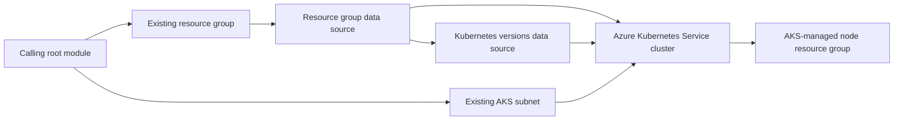

# Terraform Module for Azure Kubernetes Service

Provisions an [Azure Kubernetes Service](https://registry.terraform.io/providers/hashicorp/azurerm/latest/docs/resources/kubernetes_cluster)
cluster with a system-assigned managed identity and RBAC enabled, using the latest
non-preview Kubernetes version. The caller owns the resource group, subnet,
provider configuration, backend, and Terraform state.

## Dependency Graph



## Usage

```hcl
module "k8s" {
  source                  = "git::https://github.com/f2calv/tf_module_azurerm_kubernetes_cluster.git//src?ref=0.3.0"
  k8s_resource_group_name = azurerm_resource_group.rg.name
  k8s_cluster_name        = "mycluster"
  k8s_cluster_dns_prefix  = "mycluster-dns"
  k8s_node_resource_group = "mycluster-node-rg"
  k8s_node_pool_name      = "nodepool0"
  k8s_node_count          = 1
  k8s_vm_size             = "Standard_D2ps_v5"
  k8s_vnet_subnet_id      = azurerm_subnet.aks.id
  k8s_automatic_channel_upgrade   = "patch"
  k8s_node_os_channel_upgrade     = "NodeImage"
  k8s_maintenance_day_of_week     = "Sunday"
  k8s_maintenance_start_time      = "01:00"
  k8s_maintenance_duration_hours  = 4
  k8s_maintenance_utc_offset      = "+01:00"
  tags                    = { environment = "dev" }
}
```

The resource group and subnet in this example are created by the calling root
module and are not managed by this module.

<!-- markdownlint-disable MD060 -->
<!-- BEGIN_TF_DOCS -->
## Requirements

| Name | Version |
| ---- | ------- |
| terraform | >= 1.1 |
| azurerm | >= 5.0, < 6.0 |

## Providers

| Name | Version |
| ---- | ------- |
| azurerm | >= 5.0, < 6.0 |

## Resources

| Name | Type |
| ---- | ---- |
| [azurerm_kubernetes_cluster.this](https://registry.terraform.io/providers/hashicorp/azurerm/latest/docs/resources/kubernetes_cluster) | resource |

## Inputs

| Name | Description | Type | Default | Required |
| ---- | ----------- | ---- | ------- | :------: |
| k8s\_automatic\_channel\_upgrade | Automatic Kubernetes version upgrade channel. | `string` | n/a | yes |
| k8s\_cluster\_dns\_prefix | Optional DNS prefix to use with hosted Kubernetes API server FQDN. | `string` | n/a | yes |
| k8s\_cluster\_name | Name of the AKS cluster. | `string` | n/a | yes |
| k8s\_maintenance\_day\_of\_week | Day of the week for automatic Kubernetes and node OS maintenance. | `string` | n/a | yes |
| k8s\_maintenance\_duration\_hours | Duration in hours for automatic Kubernetes and node OS maintenance. | `number` | n/a | yes |
| k8s\_maintenance\_start\_time | Start time for automatic Kubernetes and node OS maintenance. | `string` | n/a | yes |
| k8s\_maintenance\_utc\_offset | UTC offset for the automatic Kubernetes and node OS maintenance schedule. | `string` | n/a | yes |
| k8s\_node\_count | The number of VM nodes in the default AKS node pool. | `number` | n/a | yes |
| k8s\_node\_os\_channel\_upgrade | Automatic node OS upgrade channel. | `string` | n/a | yes |
| k8s\_node\_pool\_name | The name of the default AKS node pool. | `string` | n/a | yes |
| k8s\_node\_resource\_group | Resource group for the internal objects of the node pool. | `string` | n/a | yes |
| k8s\_resource\_group\_name | Name of the parent resource group. | `string` | n/a | yes |
| k8s\_vm\_size | The size of the VM nodes in the default AKS node pool. | `string` | n/a | yes |
| k8s\_vm\_disk\_size | Disk size (in GB) to provision for each of the agent pool nodes. This value ranges from 30 to 1023. Specifying 0 applies the default disk size for that agentVMSize. | `number` | `30` | no |
| k8s\_vm\_max\_pods | Max pods per node. | `number` | `100` | no |
| k8s\_vnet\_subnet\_id | Resource ID of the subnet used by the default AKS node pool. | `string` | `null` | no |
| tags | Any tags that should be present on the resources. | `map(string)` | `{}` | no |

## Outputs

| Name | Description |
| ---- | ----------- |
| fqdn | The FQDN of the AKS cluster. |
| id | The ID of the AKS cluster. |
| kube\_config | The raw kubeconfig for the AKS cluster. |
| kube\_config\_client\_certificate | The base64-encoded client certificate for cluster authentication. |
| kube\_config\_client\_key | The base64-encoded client key for cluster authentication. |
| kube\_config\_cluster\_ca\_certificate | The base64-encoded cluster CA certificate. |
| kube\_config\_host | The Kubernetes cluster API server URL. |
| kube\_config\_password | The Kubernetes cluster admin password. |
| kube\_config\_username | The Kubernetes cluster admin username. |
| kubelet\_client\_id | The client ID of the kubelet managed identity. |
| kubelet\_object\_id | The object ID of the kubelet managed identity. |
| kubelet\_user\_assigned\_identity\_id | The user-assigned identity ID of the kubelet. |
| location | The location of the AKS cluster. |
| mi\_principal\_id | The principal ID of the cluster managed identity. |
| mi\_tenant\_id | The tenant ID of the cluster managed identity. |
| name | The name of the AKS cluster. |
<!-- END_TF_DOCS -->
<!-- markdownlint-enable MD060 -->

## Development

Regenerate the Terraform reference after changing resources, variables,
outputs, or version constraints:

```bash
terraform-docs --config .terraform-docs.yml src
```

The pre-commit configuration runs the same command in CI and fails when
generated documentation is not committed.
